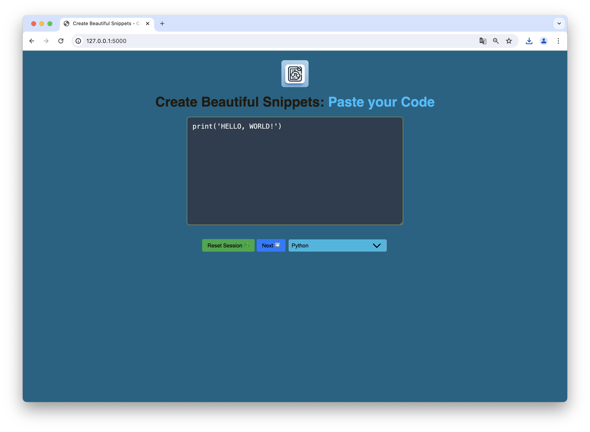
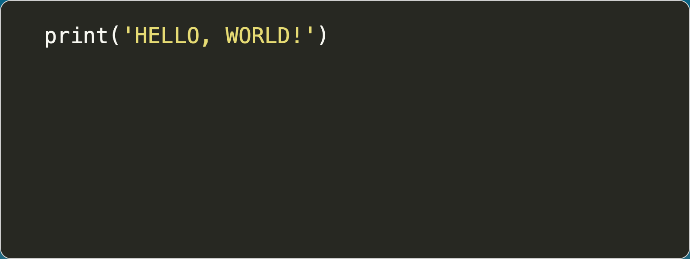

# README - CodeCraft

## Table of Contents

01. [Motivation](#01-motivation)
02. [Installation](#02-installation)
03. [Usage](#3-usage)
04. [Code](#4-code)
05. [Troubleshooting](#5-troubleshooting)
06. [Contributing](#6-contributing)
07. [Licence](#7-licence)
08. [Version](#8-version)

<hr><br>

## 01. Motivation

CodeCraft is designed to simplify sharing and visualizing code snippets. With its user-friendly interface, you can create and download beautiful syntax-highlighted code screenshots for multiple programming languages.

<hr><br>

## 02. Installation

1. **Clone the repository**:
   ```bash
   git clone https://github.com/beri336/CodeCraft
   ```

2. **Activate the virtual environment**:  
   - macOS/Linux:
     ```bash
     python3 -m venv venv
     source venv/bin/activate
     ```
   - Windows:
     ```bash
     python3 -m venv venv
     venv\Scripts\activate
     ```

3. **Install dependencies**:  
   ```bash
   pip install -r requirements.txt
   ```
   - Install Playwright browsers:
     ```bash
     playwright install
     ```

4. **Generate the `config.json`**:  
   Run the following to create a secure `SECRET_KEY`:
   ```bash
   python create_secret_key.py
   ```

5. `Now you're ready to go!`

<hr><br>

## 3. Usage

1. **Run the application**:  
   ```bash
   python app.py
   ```

2. **Access the app**:  
    - your terminal displays the port:
    ```bash
    * Running on http://127.0.0.1:8080
    ```

    - Open `http://localhost` or `http://127.0.0.1:8080` (when using standard without changing port, or paste your own port) in your browser. The interface should look like this:

    

- Based on the browser you use, the website can be displayed different.


3. **How to use it?**

- `Reset Session`: deletes the input inside the TextField and sets it back to the print seen in the picture above
- `Next`: navigates to the next page, to create the image based of the given Code
- `Dropdown-List`: to correctly show the Syntax-Highlighting, choose the programming language for the code (note: the Syntax-Highlight is seen on the next page)
- `Create Beautiful Snippets`: if clicked, it brings back to the homepage (this page)

<hr>


- Here you can see the correct Syntax-Highlight, mentioned earlier
- `Back`: goes back to the homepage
- `Create an Image`: creates the image and goes to next page
- `DropDown-List`: choose your theme (monokai is standard)

<hr>


- Your image was successfully created
- `Download Your Code Image Here`: you can download your image with this button
- `Back to Start`: goes to homepage

<hr>

- This is how your image could look like:


<hr><br>

## 4. Code

### File `app.py`

#### `load_secret_key()`
- Loads the secret key from `config.json`.

#### `code()`
- Displays the code input form and initializes session variables if unset.

#### `save_code()`
- Saves the entered code and selected language to the session.

#### `reset_session()`
- Resets the session and restores default values.

#### `style()`
- Displays the style selection page with a code preview.

#### `save_style()`
- Saves the selected style, code, and language to the session.

#### `image()`
- Captures a screenshot of the style page and returns it as a base64-encoded image.

<hr>

### File `utils.py`

#### `take_screenshot_from_url(...)`
- Captures a screenshot of an element (`.code`) from a URL using Playwright, preserving session context.

<hr>

### Folder `templates/`

#### `base.html`
- Defines the app's basic HTML structure with placeholders for dynamic content.

#### `code_input.html`
- Code input page with form fields for code and language selection.

#### `image.html`
- Displays the generated code screenshot with a download option.

#### `style_selection.html`
- Style selection page with a preview of highlighted code.

<hr>

### Folder `static/`

#### `style.css`
- Defines the application's CSS for layout, buttons, dropdowns, and responsive design.

<hr>

### File `create_secret_key.py`

#### Functionality:
- Generates a new secret key and saves it to `config.json` if it doesn’t exist.

#### Why?
- Ensures secure session management by protecting sensitive data from tampering.

<hr><br>

## 5. Troubleshooting

### Common Issues:

> **Port-Error**
```
Address already in use
Port 5000 is in use by another program.
```
- Go to the `app.py` and change the `port` to another, for example `8080` or `8000`.

<hr>

> **Secret Key Missing**
```
ValueError: A secret key is required to use the session.
```
- Make sure `config.json` exists and contains a valid `"SECRET_KEY"`. 
- If missing, run `create_secret_key.py` to generate one.

<hr>

> **ModuleNotFoundError `flask`**
```
ModuleNotFoundError: No module named 'flask'
```
- Ensure all dependencies are installed by running:
```
pip install -r requirements.txt
```

<hr>

> **Playwright Error**
```
playwright._impl._api_types.Error: Browser closed unexpectedly
```
- Make sure Playwright is installed and its browsers are set up:
```
pip install playwright
playwright install
```

<hr>

> **FileNotFoundError**
```
FileNotFoundError: [Errno 2] No such file or directory: 'static/style.css'
```
- Ensure all static files and templates are correctly placed in their respective directories (`static/` and `templates/`).

<hr>

> **Session Cookie Error**
```
RuntimeError: The session is unavailable because no secret key was set.
```
- Ensure the `app.secret_key` is correctly loaded from `config.json`.

<hr>

> **Browser Context Error in Playwright**
```
TypeError: 'NoneType' object is not callable
```
- Check if the session cookies or URL passed to `take_screenshot_from_url` are valid. Ensure the session data is properly set.

<hr>

> **UnicodeEncodeError (Windows users)**
```
UnicodeEncodeError: 'charmap' codec can't encode character
```
- Use UTF-8 encoding by setting the environment variable:
```
set PYTHONIOENCODING=utf-8
```

<hr>

> **PermissionError (Windows users)**
```
PermissionError: [Errno 13] Permission denied
```
- Ensure you have write permissions for the directory where the application is running.

<hr><br>

## 6. Contributing


<hr><br>

## 7. Licence
This project is licensed under the MIT License.

<hr><br>

## 8. Version
> **Version 1.0**
- Initial release with local hosting, code snippet creation, and image generation.