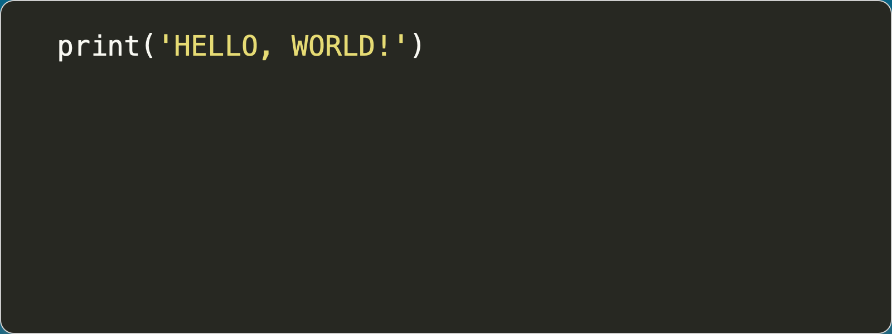

<div align="center">

# 🎨 CodeCraft

**Transform your code into beautiful, shareable images with syntax highlighting**


[Features](#-features) • [Quick Start](#-quick-start) • [Installation](#-installation) • [Usage](#-usage-guide) • [Troubleshooting](#-troubleshooting)


</div>

---

## ✨ Features

- 🎨 **Modern UI/UX** - Glassmorphism design with smooth animations and rounded corners
- 🌈 **Syntax Highlighting** - Support for 500+ programming languages via Pygments
- 🎭 **Multiple Themes** - Choose from dozens of professionally designed color schemes
- 📸 **High-Quality Screenshots** - Export code as crisp PNG images with 2x resolution
- ⚡ **Fast & Lightweight** - Built with Flask and Playwright for optimal performance
- 🔒 **Secure** - Session-based authentication with encrypted cookies
- 📱 **Responsive Design** - Works seamlessly on desktop, tablet, and mobile devices
- 🌙 **Dark Mode Optimized** - Easy on the eyes with modern dark theme

---

## 🚀 Quick Start

```bash
# Clone the repository
git clone https://github.com/beri336/CodeCraft.git
cd CodeCraft

# Run setup (recommended)
make setup

# Or manual installation
python3 -m venv .venv
source .venv/bin/activate  # On Windows: .venv\Scripts\activate
pip3 install -r requirements.txt
playwright install webkit
python3 scripts/create_secret_key.py

# Start the server
python3 app.py
```

<div align="center">

🎉 **Open `http://localhost:8080` in your browser and start creating!**

</div>

---

## 💾 Installation

### Prerequisites

- Python 3.8 or higher
- Modern web browser (Chrome 76+, Firefox 70+, Safari 14+)

### Method 1: Using Make (Recommended)

```bash
git clone https://github.com/beri336/CodeCraft.git
cd CodeCraft
make setup
```

### Method 2: Manual Installation

**Step 1:** Clone and navigate

```bash
git clone https://github.com/beri336/CodeCraft.git
cd CodeCraft
```

**Step 2:** Create virtual environment

```bash
# macOS/Linux
python3 -m venv .venv
source .venv/bin/activate

# Windows
python -m venv .venv
.venv\Scripts\activate
```

**Step 3:** Install dependencies

```bash
pip3 install -r requirements.txt
```

**Step 4:** Install Playwright browsers

```bash
playwright install webkit
```

**Step 5:** Generate secret key

```bash
python3 scripts/create_secret_key.py
```

**Step 6:** Run the application

```bash
python3 app.py
```

### Method 3: Using pip (Development)

```bash
pip3 install -e .
playwright install webkit
python3 scripts/create_secret_key.py
```

---

## 📖 Usage Guide

### Starting the Application

```bash
python3 app.py
```

<div align="center">

**The server will start at `http://127.0.0.1:8080`**

</div>

### Creating Your First Snippet

#### 1. **Code Input Page**

<div align="center">


</div>

- Paste your code into the text area
- Select your programming language from the dropdown
- Click **Next ➡️** to proceed

**Controls:**
- `Reset Session ♻️` - Clear input and reset to default
- `Next ➡️` - Move to style selection
- `Dropdown` - Choose programming language (Python, JavaScript, C++, etc.)

#### 2. **Style Selection Page**

<div align="center">


</div>

- Preview your code with syntax highlighting in real-time
- Choose a color theme from the dropdown (monokai, dracula, github, etc.)
- Click **Create an Image 📸** when satisfied

**Controls:**
- `⬅️ Back` - Return to code input
- `Create an Image 📸` - Generate high-resolution screenshot
- `Dropdown` - Select color theme

#### 3. **Download Page**

<div align="center">


</div>

- View your beautifully generated image
- Click **Download Your Code Image Here ⤵️** to save
- Click **🔄 Back to Start** to create another snippet

**Example Output:**

<div align="center">



*Professional code snippet ready for sharing on social media, documentation, or presentations*

</div>

---

## 🏗️ Architecture

### Project Structure

```bash
CodeCraft/
├── README.md                                    # Project documentation
├── app.py                                       # Main Flask application
├── utils.py                                     # Screenshot utility functions
├── config.json                                  # Configuration (auto-generated)
├── requirements.txt                             # Python dependencies
├── pyproject.toml                               # Project configuration
├── pictures/                                    # Documentation assets
│   ├── Example Code.png                         # Style selection screenshot
│   ├── Example Snippet.png                      # Download page screenshot
│   ├── GUI.png                                  # Code input page screenshot
│   ├── Your_Code_As_Image.png                   # Example output image
│   └── created-by.svg                           # Author badge
├── scripts/                                     # Utility scripts
│   ├── create_secret_key.py                     # Secret key generator
│   └── setup.sh                                 # Automated setup script
├── static/                                      # Static assets
│   ├── style.css                                # Modern UI with CSS variables
│   └── icon/
│       └── icon.png                             # Application icon
└── templates/                                   # Jinja2 templates
    ├── base.html                                # Base template with header
    ├── code_input.html                          # Code entry page
    ├── style_selection.html                     # Theme picker with preview
    └── image.html                               # Download page
```

### Core Components

#### `app.py` - Flask Application

**Routes:**

| Route | Method | Description |
|-------|--------|-------------|
| `/` | GET | Code input page with language selector |
| `/save_code` | POST | Save code and language to session |
| `/reset_session` | POST | Clear session and restore defaults |
| `/style` | GET | Style selection page with preview |
| `/save_style` | POST | Save theme and code preferences |
| `/image` | GET | Generate and display screenshot |

**Key Functions:**

- `load_secret_key()` - Loads secret key from config.json for secure sessions
- `code()` - Renders code input page with session initialization
- `save_code()` - Persists code and language selection to session
- `reset_session()` - Clears session data and restores default values
- `style()` - Displays style preview with live syntax highlighting
- `save_style()` - Saves theme, code, and language preferences
- `image()` - Captures high-quality screenshot using Playwright

#### `utils.py` - Screenshot Generator

**Function:** `take_screenshot_from_url(url, session_data)`

Uses Playwright's WebKit engine to:
1. Launch headless browser with 2x device scale factor (Retina quality)
2. Inject session cookies for authentication
3. Navigate to target URL
4. Capture screenshot of `.code` element with proper styling
5. Return high-quality PNG as bytes

**Parameters:**
- `url` (str) - Target webpage URL
- `session_data` (dict) - Cookie information for session persistence

**Returns:** `bytes` - High-resolution PNG image data

#### `create_secret_key.py` - Security Setup

Generates cryptographically secure random key using `secrets.token_hex()` and saves to `config.json`:

```json
{
    "SECRET_KEY": "a1b2c3d4e5f6..."
}
```

Used by Flask for secure session management and cookie signing to prevent tampering.

### Templates

#### `base.html`
Base layout with modern header, navigation, and content blocks. Includes Google Fonts (Inter) for modern typography.

#### `code_input.html`
Form with responsive textarea for code input and language selector. Dynamic sizing based on content length.

#### `style_selection.html`
Interactive theme picker with live preview. Auto-submits on selection change via JavaScript for seamless UX.

#### `image.html`
Displays base64-encoded PNG with one-click download link. Includes back-to-start navigation.

### Styling

**`style.css`** - Modern Design System

Features:
- CSS Custom Properties (variables) for consistent theming
- Glassmorphism effects with backdrop-filter blur
- Smooth cubic-bezier transitions (0.3s)
- Responsive design with mobile-first approach
- Custom scrollbar styling for all browsers
- Interactive hover animations with scale and glow effects
- Gradient backgrounds for depth
- Dark mode optimized color palette
- Rounded corners (8px-24px) throughout
- Box shadows with multiple elevation levels

---

## 🔧 Troubleshooting

### Port Already in Use

```bash
OSError: [Errno 48] Address already in use
```

**Solution:** Change port in `app.py`:

```py
if __name__ == "__main__":
    app.run(debug=True, host='0.0.0.0', port=8000)  # Changed from 8080
```

---

### Secret Key Missing

```bash
ValueError: A secret key is required to use the session.
```

**Solution:** Generate secret key:

```bash
python3 scripts/create_secret_key.py
```

Verify `config.json` exists with valid `SECRET_KEY`.

---

### Playwright Browser Missing

```bash
playwright._impl._errors.Error: Executable doesn't exist at ...
```

**Solution:** Install Playwright browsers:

```bash
playwright install webkit

# Or with system dependencies (Linux)
playwright install --with-deps webkit
```

---

### Browser Closed Unexpectedly

```bash
playwright._impl._api_types.Error: Browser closed unexpectedly
```

**Possible causes:**
1. Insufficient system resources (RAM/CPU)
2. Missing system dependencies
3. Incompatible Playwright version

**Solution:**

```bash
# Reinstall Playwright
pip3 uninstall playwright
pip3 install playwright
playwright install --with-deps webkit
```

---

### Session Cookie Error

```bash
RuntimeError: The session is unavailable because no secret key was set
```

**Solution:** Check `app.py` loads secret key correctly:

```py
def load_secret_key():
    with open('config.json') as config_file:
        config = json.load(config_file)
    return config["SECRET_KEY"].encode()
```

Ensure `config.json` exists and contains a valid key.

---

### Development Setup

```bash
# Install with dev dependencies
make dev-install

# Run tests
make test

# Format code
make format

# Clean cache
make clean
```

---

## 📝 License

This project is licensed under the MIT License - see the [LICENSE](LICENSE) file for details.

---

<div align="center">

## 👨‍💻 Author

**Berkant Simsek**


[](https://github.com/beri336)
[](https://github.com/beri336/CodeCraft)

</div>

---

## 📊 Version History

### v2.0.0 (2025-12-25) 🎄
- 🎨 Complete UI/UX redesign with glassmorphism
- ✨ Modern design system with CSS variables
- 🎭 Smooth animations and transitions
- 📱 Improved responsive design
- ♿ Enhanced accessibility
- 🔄 Rounded corners throughout
- 💫 Glow effects and hover animations
- 🌈 Gradient backgrounds

### v1.0.0 (Initial Release)
- 🚀 Initial release
- 📸 Code screenshot generation
- 🌈 Multiple syntax highlighting themes
- 💾 Session-based state management
- 🔒 Secure cookie handling

---

## Acknowledgments

- [Flask](https://flask.palletsprojects.com/) - Lightweight WSGI web framework
- [Pygments](https://pygments.org/) - Syntax highlighting engine
- [Playwright](https://playwright.dev/) - Browser automation library
- [Inter Font](https://rsms.me/inter/) - Beautiful modern typeface
- [Shields.io](https://shields.io/) - Badge generation service

---

<div align="center">

**[⬆ Back to top](#-codecraft)**

Made with ❤️ by [Me](https://github.com/beri336)

</div>